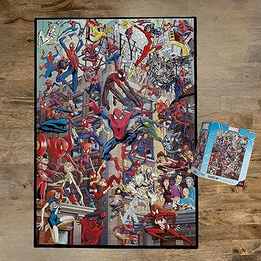

<html>
<head>
    <title>Alejandra's Biography</title>
</head>
    <body style="background-color:E3C9D1;">

    <h1 style="Font-size:25px;color:B97375;">Alejandra Leal Assignment 2 CSIT100-37</h1>
        

        

Alejandra's Biography

        

Summary:

    
I am the eldest of 4 in an Mexican immigrant household. I grew up to be very family-and-friend oriented. I do tend to keep to myself most of the time, but I have been trying to break out of my shell. I am currently a Marine Biology student at Montclair State University. I am not certain of what I want my future career to be, but I think I am heading towards a research direction.   

 

Hobbies:

<ul>
    <li style="color:A96060">I love to bake. I have baked all kinds of desserts but my favorite sweet to bake is cookies. There is a bais recipe and you can add so mnay different things for different flavors. </li>
    
    <li style="color:A96060">I picked up this hobby during the COVID pandemic. I also love doing jigsaw puzzles. I started out with smaller puzzles but I was finishing them quickly. I then moved up to 1000 piece puzzles and I was still completing them within a day or two. The biggest puzzle I have done was a 3000 piece SpiderMan puzzle. </li>
    
</ul>
 

Education & Work History
 
<table align="center" border="1" width="800"; style="color:4B2E39">
<tr>
<td>Education:</td>
<td>Work:</td>
</tr>
<tr>
<td>Montclair State University (2022 - Present): Currently a Sophomore in Marine Biology. I am hoping to switch over to Biology with the idea of going into research later in life. </td>
<td>Old Navy (2022 - Present): This is my first job and I mainly work out on the floors helping customers. It is a relatively easy job but there are time when hours are inconsistant.</td>
</tr>
</table>

        
</body>
</html>
